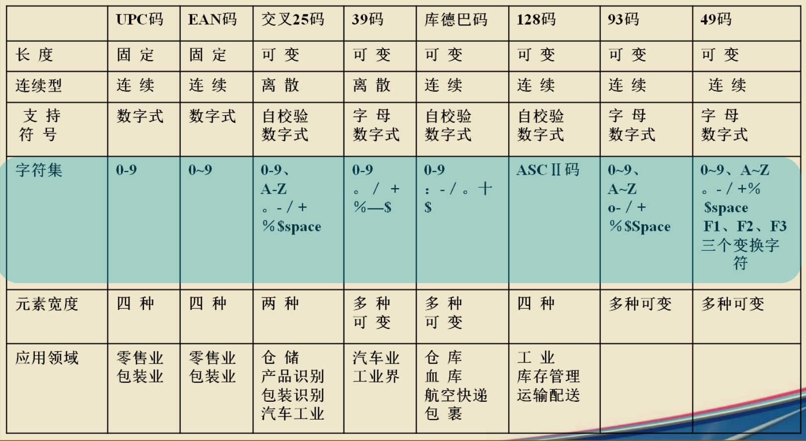
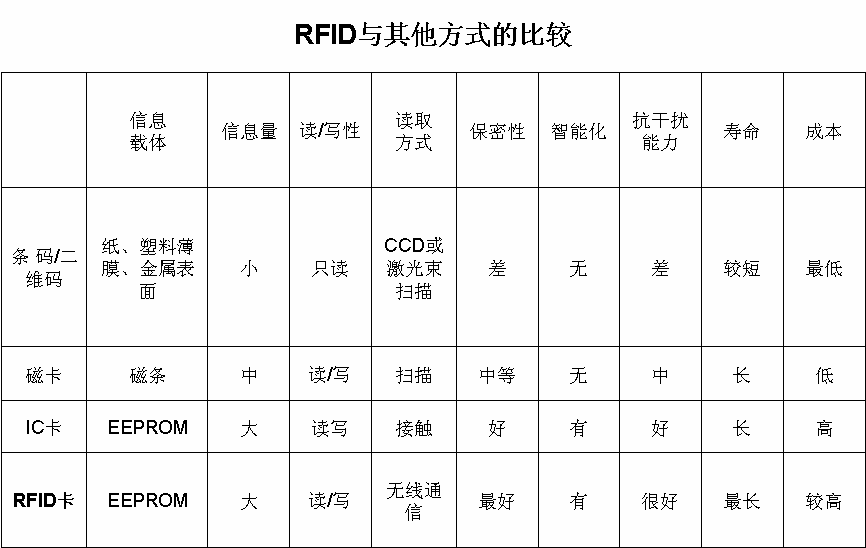
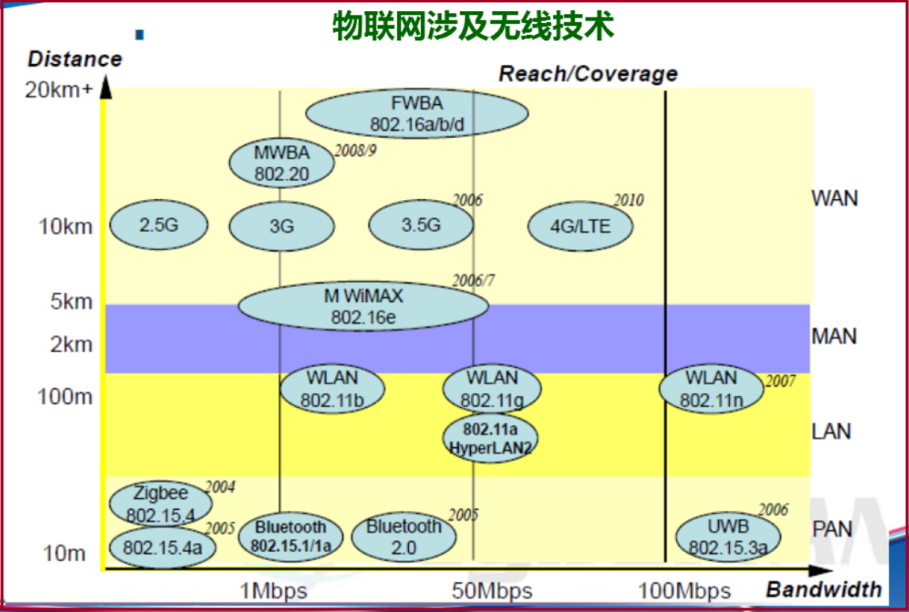
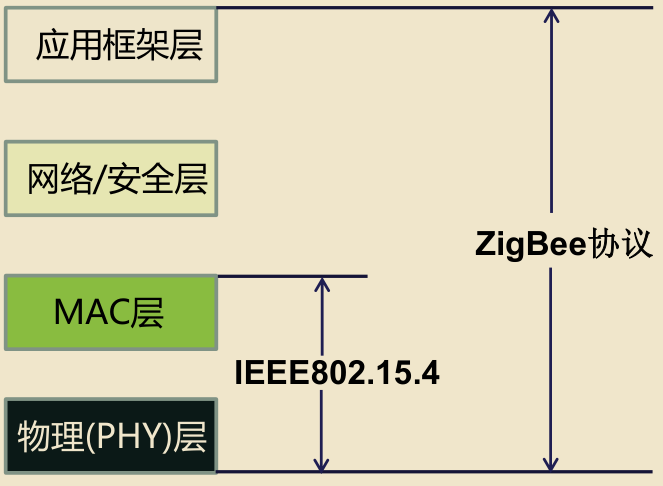
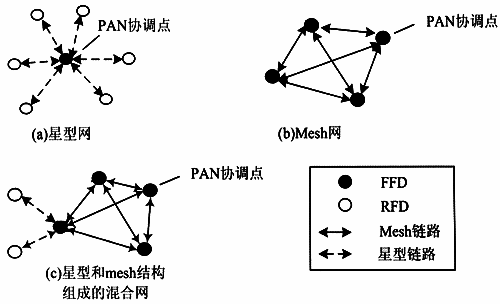
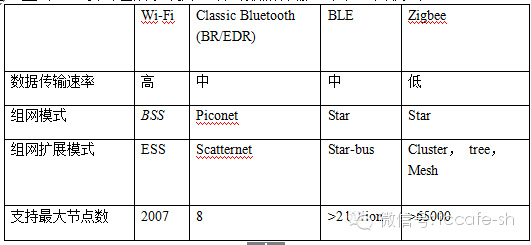
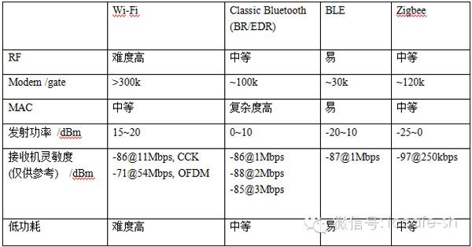
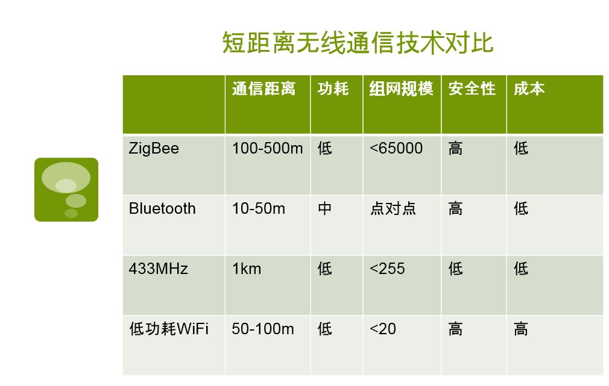

# 复习笔记

## 第一章 引论

### 一些概念

- **物联网定义**

    1. 中国物联网校企联盟将物联网定义为：当下几乎所有技术与计算机、互联网技术的结合，实现物体与物体之间：环境以及状态信息实时的实时共享以及智能化的收集、传递、处理、执行。
    2. 物联网就是“物物相连的互联网”，是通过各类传感装置、RFID技术、视频识别技术、红外感应、全球定位系统、激光扫描器等信息传感设备，按照约定的协议，根据需要实现物品互联互通的网相连接，进行信息交换和通信，以实现智能化识别、定位、跟踪、监控和管理的智能网络系统。
    3. 最简洁的提法：把所有物品通过信息传感设备与互联网连接起来，以实现智能化识别和管理
    4. 中国提法：物联网是一个基于互联网、传统电信网等信息承载体，让所有能够被独立寻址的普通物理对象实现互联互通的网络，他具有：
        1. 普通终端设备化
        2. 自治终端互联化
        3. 普适服务智能化

- **物联网架构**：应用层、网络层、感知层

- **嵌入式系统的定义**：嵌入式系统(Embedded Systems)是指**以应用为中心、以计算机技术为基础、软件硬件可裁剪、适应应用系统对功能、可靠性、成本、体积、功耗严格要求的专用计算机系统**。

    **电器工程师协会定义**：嵌入式系统是用来控制或监视机器、装置、工厂等大规模系统的设备。

- 物联网产业链**DCM**三驾马车

    | 层次   | 组成             | “马车”                               |
    | ------ | ---------------- | ------------------------------------ |
    | 应用层 | 管理和应用系统   | 物联网之**M**anage（管理和应用软件） |
    | 网络层 | 通信连接系统     | 物联网之**C**onnect（连接与通信）    |
    | 感知层 | 末端设备或子系统 | 物联网之**D**evices（设备或资产）    |

- **光物联**：光物联是基于光电子技术与物联网应用的深度融合，通过光感知、光传输、光显示、光照明等技术与应用节点，实现光电技术与物联网产业的全面对接。

    光物联产业是物联网产业的深入和细化，是物联网产业差异化、特色化发展的重要内容。

    光物联在体系架构上，与物联网的整体体系架构相类似，也可相应的分为五层，分别包括：

    - 技术支撑层
    - 感知层
    - 传输层
    - 平台层
    - 应用层
    
- 物联网概念**最关注以人为中心，建立为人服务的物的基础架构和应用体系**

    - E社会模型
        - 强调以人为中心的**任意可达的网络**
        - 强调以人为中心的**按需可用的服务**
    - 智慧地球模型
        - 强调为人服务的生产生活各个方面
        - 强调为人服务的智能处理能力提升

    物联网不仅仅是包含一切的连接物的网络，其**核心是以人为中心的物的网络和为人服务的应用**。

- 物联网产业关注的核心要素

    - 全面感知
        - 传感器和RFID
        - 智能嵌入技术
    - 可靠传送
        - 短距无线和传感网技术
        - IP化多业务承载的公网
    - 智能处理
        - 信息IT技术深入各行业
        - 物物&人物交互的智能中枢
    
- 技术体系架构模型

    - **感知层**主要用于获取信息，根据需要的不同，有多种感知器

        **关键技术**：传感器成本，功耗

    - **传输层**主要功能是直接通过现有的网络进行信息接入与传输。（互联网、移动通信网、无线局域网、卫星网）

        **关键技术**：传输速率，数据格式，数据融合，制定统一的传输协议

    - **支撑层**在高性能计算技术的支撑下，将网络内的大量信息资源通过计算和整合成互联互通的智能网络，为上层服务管理和大规模行业应用建议一个支撑技术平台

        **关键技术**：云计算，数据管理存储与挖掘

    - **应用层**根据用户需要构建面向各类行业实际应有的管理平台和运行平台以及各种中间件

        **关键技术**：各种中间件的设计

- 物联网和智慧地球理念能够得以实现的原因，是因为世界早已经迈入了**3I时代**（IBM提法）：

    - **Instrumented**，工具植入化，40亿手机用户，30亿RFID，庞大的传感网络和工业信息化系统等
    - **Interconnected**，互联化
    - **Intelligent**，智能化

- 实现**5A化**的物联网世界

    1. **Anywhere**，任何地点
    2. **Anything**，任何事物
    3. **Anytime**，任何时间
    4. **Anyway**，任何方式
    5. **Anyhow**，任何原因

- 物联网三大应用场景

    - 基于RFID的物联网应用架构，即身份识别业务
    - 基于传感网络的物联网应用架构
    - 基于M2M的物联网应用架构，即信息汇聚型业务

- `WSN, Wireless Sensor Network`[Introduction on GeeksForGeeks](https://www.geeksforgeeks.org/wireless-sensor-network-wsn/)

- 物联网应用实例

    - 小麦苗情监测物联网应用
    - 苏州环卫信息系统
    - 宁波环卫模式

### 嵌入式系统的组成

嵌入式系统的组成一般包括软件和硬件

- 硬件
    - 嵌入式CPU
    - 外围硬件设备
- 软件
    - 嵌入式操作系统
    - 用户应用程序

#### 典型的嵌入式CPU

1. ARM
2. MIPS：MIPS是`Microprocessor without Inter---locked Pipeline Stages`的缩写，是**一种处理器内核标准**，它是由MIPS技术公司开发的
3. PowerPC：可以用于各种集成的系统芯片(SoC)上，在电信、金融和其它许多行业具有广泛的应用
4. x86：在嵌入式领域应用并不广泛
5. 68000：一款出现的比较早的嵌入式处理器，68K采用的是CISC结构，与现在的PC指令集保持了二进制兼容

#### 嵌入式操作系统

1. 嵌入式Linux
2. μC/OS
3. Windows CE
4. VxWorks
5. Palm OS
6. QNX
7. LynxOS
8. 国内的几个操作系统
    1. DeltaOS
    2. Hopen OS
    3. EEOS
    4. HBOS

### 架构

#### 感知层

感知层是物联网全面感知的基础

- 感知层作用
    - 感知和识别物体
    - 采集和捕获信息
- 感知层实现方式
    - RFID标签和读写器
    - M2M终端和传感器
    - 传感器网络和网关
    - 摄像头和监控
    - GPS/北斗定位授时
    - 智能家居网关
- 感知层突破方向
    - 更敏感和更全面的感知能力
    - 解决低功耗的问题
    - 解决小型化和低成本问题

#### 网络层

网络层是物联网无处不在的前提

- 网络层作用
    - 连接感知层和应用层
    - 随时随地的连接实现
    - 当前最成熟的部分
- 网络层主要层次
    - 接入网：无线/光纤各种类型的接入形式
        - 无线接入：2G/3G/LTE/WLAN/WiMax
        - 有线接入：光纤（PON）和铜线（xDSL）
        - 汇集承载：IP化传输网络（PTN/CE）
    - 核心网：统一IP协议上的大带宽的可靠网络
        - 统一IP协议的高效率的核心网络/设备/接口
        - 针对海量流量和高可靠性要求的拓扑和机制
        - 边缘业务控制实现业务感知、控制和策略转发
    - 业务支撑平台：业务统一管理部署和运营支撑
        - 提供终端和业务的通道和联动控制逻辑
        - 实现不同终端和业务统一管理、部署和扩展
        - 针对客户提供用户自定义业务环境和接口
- 网络层突破方向
    - 扩展规模，以实现无处不在
    - 业务可扩展的管理运营能力
    - 简化结构，上下层面融合

#### 应用层

应用层是物联网智能处理的中枢

- 应用层作用
    - 信息技术与行业专业技术结合
    - 实现广泛智能化应用的解决方案集合
- 应用层主要应用方向
    - 智能家居
    - 智能交通
    - 智能城管
    - 智能电力
    - 智能医疗
    - 智能通信服务
- 应用层突破方向
    - 信息技术与行业的深度融合
    - 信息的社会化共享和安全保障
    - 基于云计算的应用整体架构
        - SaaS
        - PaaS
        - IaaS

### 物联网发展的演进路线

- 现在业界有一种认识，认为**从信息汇聚，到协同感知，再到泛在聚合是物联网的必然发展趋势**，但是并不是所有物联网的业务都会发展到泛在聚合的阶段
- 很多应用和服务只要求信息汇聚，但是这些信息是封闭的、机密的、只对小部分群体有效，这种服务和应用在现实中很难实现泛在汇聚

#### 信息汇聚

- **主要特征**：将**分布于多区域的、利用多种感知技术手段所采集到的信息进行汇聚**，通过通信网络将感知信息汇聚到业务应用系统，集中进行信息的处理与共享，并提供信息应用服务

- **关键技术**：

    - 传感器设计与实现
    - 短距离无线传输技术
    - 低功耗技术
    - 电磁兼容技术等

    实现相关信息采集、汇聚设备的小型化、低功耗、低成本、国产化和绿色环保。

#### 协同感知

- **主要特征**：以**事件、任务和目标为驱动**进行感知、网络和应用各个层面的协同工作，系统具备分布式、跨层次、自学习的协同处理能力，提供智能、精确的多元化信息服务
- **关键技术**：
    - 任务驱动的大规模自治组网技术
    - 上下文感知技术
    - 移动通信网络与无线传感器网络无缝融合技术
    - 海量信息处理技术等

#### 泛在聚合

- **主要特征**：泛在的感知服务**将海量信息进行聚合，产生出新的有应用价值的信息**，即物联网广泛应用于各个领域，实现任何人、任何物体、任何时间、任何地点的互联互通，引发新的应用和服务模式
- **关键技术**：
    - 信息聚合理论
    - 模糊控制技术
    - 泛在异构网络
    - 人工智能
    - 仿生传感器
    - 纳米材料
    - 生物芯片等
- 泛在聚合目标举例
    - 智能交通：比如一座拱桥（类似这种感觉），桥的A头有人行道，一辆汽车从B头驶向A头，当A头有行人过人行道时，我们可以提前通知这辆汽车，以便驾驶员做出适当的避让

### 物联网关键技术

- 物联网核心技术包括：

    1. 射频识别装置（RFID）
    2. WSN网络
    3. 红外感应器
    4. 全球定位系统
    5. Internet与移动网络
    6. 网络服务
    7. 行业应用软件

    在这些技术中，又以底层嵌入式设备芯片开发最为关键，引领整个行业的上游发展，例如RFID技术和WSN技术等

- 物联网服务主要涉及的关键技术

    1. 传感器技术
    2. 传感器网络技术
    3. 传感网络相关的通信技术
    4. 通信网络技术
    5. 物联网平台技术，以及他们之间的结合技术

## 第二章 标识技术

目前数据自动采集主要使用了：

1. 条形码技术
2. IC卡技术
3. 射频识别技术
4. 光符号识别技术
5. 语音识别技术
6. 生物计量识别技术
7. 遥感监测
8. 机器人智能感知等技术

感知识别技术融合物理世界和信息世界，是物联网区别于其他网络最独特的部分

### 条形码技术

- 条形码是**一种信息图形化表示方法**，可以把信息制作成条形码，然后用相应的扫描设备把其中的信息输入到计算机中
- **条形码是由一组规则排列的条、空以及对应的字符组成的标记**。当使用专门的条形码识别设备如手持式条码扫描器扫描这些条码时，条码中包含的信息就转化为计算机可识别的数据
- 目前市场上常见的是**一维条形码**，**信息量约几十位数据和字符**；**二维条形码**相对复杂，但**信息量可达几千字符**

#### 一维条形码

- 一维条码是由一组规则排列的**条、空以及对应的字符**组成的标记

- 一个完整的条码的组成次序依次为：

    - 静区（前）
    - 起始符
    - 数据符
    - （中间分割符，主要用于EAN码）
    - （校验符）
    - 终止符
    - 静区（后）

- **模块**：**构成条码的基本单位**是模块，模块是指**条码中最窄的条或空**，模块的宽度通常以mm或mil（千分之一英寸）为单位

- **单元**：**构成条码的一个条或空称为一个单元**，一个单元包含的模块数是由编码方式决定的，有些码制中，如EAN码，所有单元由一个或多个模块组成；而另一些码制，如39码中，所有单元只有两种宽度，即宽单元和窄单元，其中的窄单元即为一个模块

- **密度**：**条码的密度指单位长度的条码所表示的字符个数**。模块尺寸越小，密度越大，所以密度值通常以模块尺寸的值来表示（如5mil）。通常`7.5mil`以下的条码称为**高密度条码**，`15mil`以上的条码称为**低密度条码**

- **宽窄比**：对于**只有两种宽度单元的码制，宽单元与窄单元的比值称为宽窄比**，一般为2-3左右（常用的有2：1，3：1）。宽窄比较大时，阅读设备更容易分辨宽单元和窄单元，因此比较容易阅读

- **对比度**（PCS）：条码符号的光学指标，**PSC值越大则条码的光学特性越好**

- **条码长度**：从条码起始符前缘到终止符后缘的长度

- **条码密度**：单位长度的条码所表示的字符个数

- **双向条码**：条码的两端都可以作为扫描起点

- **中间分隔符**：在条码符号中，**位于两个相邻的条码符号之间且不代表任何信息的空**

- **连续性条码**：在条码字符中，**两个相邻的条码字符之间没有中间分隔符的条码**

- **非连续性条码**： 在条码字符中，**两个相邻的条码字符之间存在中间分隔符的条码**

- **译码原理**： 激光扫描仪通过一个激光二极管发出一束光线，照射到一个旋转的棱镜或来回摆动的镜子上，反射后的光线穿过阅读窗照射到条码表面，光线经过条或空的反射后返回阅读器，由一个镜子进行采集、聚焦，通过光电转换器转换成电信号，该信号将通过扫描器或终端上的译码软件进行译码

- 典型一维条形码制比较

    

#### 二维条形码

- **二维码利用某种特定的几何图形按一定规律在平面（二维方向上）分布的黑白相间的图形记录数据符号信息的**；在代码编制上巧妙地利用构成计算机内部逻辑基础的“0”、“1”比特流的概念，**使用若干个与二进制相对应的几何形体来表示文字数值信息**，通过图像输入设备或光电扫描设备自动识读以实现信息自动处理

- 二维码具有条码技术的一些共性：

    - 每种码制有其特定的字符集
    - 每个字符占有一定的宽度
    - 具有一定的校验功能等

    同时还具有对不同行的信息

    - 自动识别功能
    - 处理图形旋转变化等特点

- 目前，世界上应用最多的二位条码符号有

    1. Aztec Code
    2. PDF147
    3. DataMatrix
    4. QR Code
    5. Code 16K等

### 磁卡

一种**卡片状的磁性记录介质**，**利用磁性载体记录字符与数字信息**，用来识别身份或其他用途

按照使用基材的不同，可以分为：

- PET卡，涤纶树脂
- PVC卡，聚氯乙烯
- 纸卡

视磁层构造的不同，又可分为

- 磁条卡
- 全涂磁卡

磁条内部可分为**三个独立的磁道**，称为TK1、TK2、TK3

- TK1最多可写79个字母或字符
- TK2最多可写40个字符
- TK3最多可写107个字符

磁条是**一层薄薄的由排列定向的铁性氧化粒子组成的材料**（也称之为颜料），用树脂粘合剂严密地粘合在一起，并粘合在诸如纸或塑料这样的非磁基片媒介上

### IC卡

IC卡，`Integrated Circuit Card`，即“集成电路卡”在日常生活中已随处可见。实际上是一种数据存储系统，如有必要还可附加计算能力。

一个标准的IC卡应用系统通常包括：

- IC卡 
- IC卡接口设备（IC卡读写器）
- PC
- 较大的系统还包括
    - 通信网络
    - 主计算机等

IC卡工作的**基本原理**是：

- 射频读写器向IC卡发一组固定频率的**电磁波**，卡片内有一个LC串联谐振电路，其频率与读写器发射的频率相同，这样在电磁波激励下，LC谐振电路产生共振，从而使电容内有了电荷；
- 在这个电容的另一端，接有一个单向导通的电子泵，将电容内的电荷送到另一个电容内存储，当所积累的电荷达到**2V**时，此电容可作为电源为其它电路提供工作电压，将卡内数据发射出去或接受读写器的数据。

**非接触式IC卡**又称**射频卡**，采用射频技术与IC卡的读卡器进行通讯，成功地解决了**无源（卡中无电源）和免接触**这一难题，是电子器件领域的一大突破。

主要用于公交、轮渡、地铁的自动收费系统，也应用在门禁管理、身份证明和电子钱包。

IC卡也叫**智能卡**，它是通过在集成电路芯片上写的数据来进行识别的。

一个完整的**IC卡应用系统**由以下几部分组成：

- **IC卡**，由持卡人掌管，记录持卡人特征代码、文件资料的便携式信息载体
- **接口设备**， 即**IC卡读写器**，是卡与PC信息交换的桥梁，且常是IC卡的能量来源。**核心为可靠的工业控制单片机**，如Intel的51系列等
- **PC**，系统的核心，完成信息处理、报表生成输出和指令发放、系统监控管理以及卡的发行与挂失、黑名单的建立等
- **网络与计算机**， 通常用于金融服务等较大的系统

IC卡是将一个微电子芯片嵌入符合**ISO 7816标准**的卡基中，做成卡片形式。

IC卡读写器是IC卡与应用系统间的桥梁，在ISO国际标准中称之为**接口设备IFD(InterFace Device)。**

**IFD内（即读写器内）CPU或控制器**通过一个接口电路与IC卡进行通信。

IC卡接口电路是IC卡读写器中至关重要的部分，根据实际应用系统的不同，可选择**并行通信、半双工串行通信和I2C​通信**等不同的IC卡读写芯片。

#### IC卡分类

按芯片

- 存储器卡

- CPU卡

    按与外界数据交换界面

    - 接触式IC卡
    - 非接触式IC卡

    按应用领域

    - 金融卡
    - 非金融卡

    按与外界数据传输形式

    - 串行通信卡
    - 并行通信卡

- 逻辑加密卡

##### 存储器卡

存储器卡卡内嵌入的芯片为**存储器芯片**，这些芯片多为**通用E2PROM（或Flash Memory）**；**无安全逻辑**，可对片内信息不受限制地任意存取；卡片制造中也很少采取安全保护措施；**不完全符合或支持ISO/IEC 7816国际标准**，而多采用**两线串行通信协议（I2C总线协议）或3线串行通信协议**。

存储器卡**功能简单**，**没有（或很少有）安全保护逻辑**，但价格低廉，开发使用简便，存储容量增长迅猛，因此**多用于某些内部信息无须保密或不允许加密（如急救卡）的场合**

##### 逻辑加密卡

逻辑加密卡由**非易失性存储器和硬件加密逻辑**构成，一般是专门为IC卡设计的芯片，**具有安全控制逻辑**，**安全性能较好**；同时**采用ROM、PROM、E 2 PROM等存储技术**；从芯片制造到交货，均采取较好的安全保护措施，如运输密码TC（Transport Card）的取用；**支持ISO/IEC 7816国际标准。**

逻辑加密卡**有一定的安全保证，多用于有一定安全要求的场合**，如保险卡、加油卡、驾驶卡、借书卡、IC卡电话和小额电子钱包等。

##### CPU卡

CPU卡也称**智能卡**。CPU卡的硬件构成包括**CPU、存储器**（含RAM、ROM、E2PROM等）、卡与读写终端通信的**I/O接口**及**加密运算协处理器CAU**，ROM中则存放有**COS（Chip Operation System，片内操作系统）**。

计算能力高，存储容量大，应用灵活，适应性较强。

**安全防伪能力强**。不仅可验证卡和持卡人的合法性，且可鉴别读写终端，已成为**一卡多用**及**对数据安全保密性特别敏感场合**的最佳选择，如手机SIM卡等。

真正意义上的“智能卡”。

###### CPU卡的进一步分类

按交换界面分类

- 接触式IC卡

    有**多个金属出点为卡芯片与外界的信息传输媒介**，成本低，实施相对简便

- 非接触式IC卡

    不用触点，**借助无线收发传送信息**，在接触式IC卡不能胜任的交通运输等诸多场合有较多应用

按应用领域分类

所谓应用领域就是是否应用于金融，也就是银行

- 金融卡（银行卡）

    又可以分为：

    - 信用卡：可透支预先设定的金额
    - 现金卡：可用作电子钱包、电子存折，不能透支

- 非金融卡（非银行卡）

    **涉及范围极广**，实质上囊括了金融卡之外的所有领域，如：门禁卡、组织代码卡、医疗卡、保险卡、IC卡身份证、电子标签等

按数据传输形式分类

- 串行通信卡

    串行通信卡即为**目前最常用的卡**，也是目前国际标准中所规定的接口方式

    采用串行方式与外界交换信息，**卡芯片引脚较少**，易于封装和接口。但随着芯片存储容量的增大，引发了两个问题：

    - 一是芯片面积急剧增长，给卡的封装带来困难
    - 二是读写时间过长，读写1 MB的容量需要12分钟

- 并行通信卡

    并行通信卡由于采用**并行通信**，没有串行通信卡的两个问题，但**国际标准中尚无此类接口标准**。例如某种P型IC卡的引脚数多达32个，不仅速度极快，而且容量增大。与串行通信卡一样，它也有**存储型、逻辑加密型和CPU型**，并已在纳税申报等系统中得以应用。

#### 一个实例：智能IC卡售饭收费管理系统

- 系统组成
    - 硬件部分
        - 电脑
        - 发卡器
        - 交换机
        - 售饭机
        - IC卡
        - 数据网线等
    - 软件部分
        - 智能IC卡售饭管理软件
    
- 系统运行环境

    该系统采用**总线型+星型**的网络拓扑结构

    - 客户端采用Windows9x/xp/2000
    - 服务器端采用Windows2000Server、SQL_SERVER2000中央数据库集成方式与通用的互联软件技术

- IC卡售饭系统通信协议

    该系统是基于以太网的C/S体系，以太网和TCP/IP网络通信协议,遵循标准的TCP/IP协议进行网络数据传输通讯，与其它系统处于同层的网络体系中，其中系统的数据采集采用标准的TCP/IP协议,充分利用布线系统来进行高层、可靠的数据交互和通讯，从结构上保证了系统可靠便捷的数据接口，系统的扩展能力，并保证了冗余系统的实现和稳定工作。

### RFID技术

RFID的全称为`Radio Frequency Identification`，即**射频识别**，俗称**电子标签**。

RFID射频识别是一种**非接触式的自动识别技术**，主要用来为各种物品建立**唯一的身份标识**，是物联网的重要支持技术 。

RFID**利用射频信号通过空间耦合**（交变磁场或电磁场）实现**无接触信息传递**并通过所传递的信息达到**识别**目的

RFID较其它技术明显的优点是电子标签和阅读器**无需接触**便可完成识别。

它是**19世纪90年代**兴起的自动识别技术，首先在欧洲市场上得以使用，随后在世界范围内普及

#### RFID系统组成

##### 观点1

RFID系统由五个组件构成，包括：传送器、接收器、微处理器、天线、标签。

传送器、接收器和微处理器通常都被封装在一起，又统称为 阅读器(Reader)，所以工业界经常将RFID系统分为**阅读器、天线和标签**三大组件，这三大组件一般都可由不同的生厂商生产。

##### 观点2

RFID系统组成包括：**电子标签，读写器（阅读器），以及作为服务器的计算机**。其中，电子标签中包含RFID芯片和天线。

#### 系统原理

无线射频识别技术（RFID）的基本原理是**利用射频信号和空间耦合（电感或电磁耦合）或雷达反射的传输特性，实现对被识别物体的自动识别**。

**RFID是一种简单的无线系统**，从前端器件级方面来说，只有两个基本器件，用于控制、检测和跟踪物体。

系统由**一个询问器（阅读器）和很多应答器（标签）**组成。

#### 阅读器

阅读器是RFID系统最重要也是最复杂的一个组件。因其工作模式一般是**主动向标签询问标识信息，所以有时又被称为询问器（Interrogator）**。

阅读器可以通过**标准网口**、**RS232串口**或**USB接口**同主机相连，通过天线同RFID标签通信。

有时为了方便，阅读器和天线以及智能终端设备会集成在一起形成可移动的**手持式阅读器**。

阅读器主要由**射频模块**和**控制模块**组成，其中射频模块包括发射器、接收器以及计时器，控制模块由微控制器和存储器组成。

射频模块与控制模块通过**调制解调器**连接，射频模块除了负责对信号进行调制和解调以外还需要对解调后的信号进行方法、整形的加工处理。

#### 天线

天线同阅读器相连，用于在标签和阅读器之间传递射频信号。阅读器**可以连接一个或多个天线**，但**每次使用时只能激活一个天线**。RFID系统的**工作频率从低频到微波**，这使得天线与标签芯片之间的匹配问题变得很复杂。

#### 标签

标签（Tag） 是由**耦合元件**、**芯片**及**微型天线**组成， **每个标签内部存有唯一的电子编码，附着在物体上，用来标识目标对象**。标签进入RFID阅读器扫描场以后，接收到阅读器发出的射频信号，凭借感应电流获得的能量发送出存储在芯片中的电子编码（**被动式标签**），或者主动发送某一频率的信号（**主动式标签**）。

##### 标签采用的存储方式

- 电可擦可编程只读存储器（EEPROM），**写入功耗大**，**使用寿命**一般为**100, 000次**
- 铁电随机存取存储器（FRAM），相比EEPROM，**写入功耗消耗减小100倍**，**写入时间甚至缩短1000倍**，**非易失类存储器**，由于生产方面的问题至今未广泛应用
- 静态随机存取存储器（SRAM），能快速写入数据，适用于微波系统，**需要辅助电池**不间断供电

##### 分类

- **被动式标签**：内部没有电源设备又被称为**无源标签**。被动式标签内部的集成电路**通过接收由阅读器发出的电磁波进行驱动**，向阅读器发送数据。
- **主动式标签**：标签内部携带电源又被称为**有源标签**。电源设备和与其相关的电路决定了**主动式标签要比被动式标签体积大、价格昂贵**。主动标签**通信距离更远**，可达上百米远。
- **半主动式标签**：这种标签兼有被动标签和主动标签的所有优点，**内部携带电池**，能够为标签内部计算提供电源。**可以携带传感器**，用于**检测环境参数**，如温度、湿度、是否移动等。然而和主动式标签不同是它们的通信并不需要电池提供能量，而是像被动式标签一样通过阅读器发射的电磁波获取通信能量。

##### 与条形码相比有什么优点？

- **体积小且形状多样**
- **耐环境性**，对水、油等物质有极强的抗污染性
- **可重复使用**
- **穿透性强**，被非金属或非透明材质包裹的情况下也可以进行穿透性通讯
- **数据安全性**，标签内部通过**循环冗余校验（CRC）**保证标签发送的数据准确性

#### 频率

RFID频率是RFID系统的一个很重要的参数指标，它决定了工作原理、通信距离、设备成本、天线形状和应用领域等因素。

RFID典型的工作频率有 `125KHz、133KHz、13.56MHz、27.12MHz、433MHz、860-960MHz、2.45GHz、5.8GHz`等。按照工作频率的不同，RFID系统集中在**低频**、**高频**和**超高频**三个区域。

**低频范围**为：`30kHz-300kHz`。低频标签一般都为无源标签，通信范围一般小于1米。通过电**感**耦合获取工作能量。除金属材料影响外，低频信号一般能够穿过任意材料的物品而不降低它的读取距离。

**高频范围**为：`3Mhz-30MHz`。通信距离一般也小于1米。该频率的标签不再需要线圈绕制，可以通过腐蚀或者印刷的方式制作标签内的天线，通过电**感**耦合的方式获取能量。

**超高频范围**为：`300MHz-3GHz`。3GHz以上为微波范围。可以是有源标签和无源标签两种。通信距离一般大于1米，典型情况为4-6米，最大可超过10米。电**磁**耦合。

#### 标签冲突及防冲突算法

**多个标签**同时处于阅读器识别范围之内，或多个标签同时向阅读器发送标志信号时，将发生标签信号冲突。

现有的**基于时分多址防冲突算法**可以分为**基于ALOHA机制的算法**和**基于二进制树的算法**两种类型。

##### 基于ALOHA的防冲突算法

- **纯ALOHA防冲突算法**，算法简单，易于实现，但**信道利用率仅为18.4%**，性能非常不理想。实际上就是随机发送。
- **分时隙的ALOHA防冲突算法**，S-ALOHA，该算法将纯ALOHA算法的时间分为若干时隙，**每个时隙大于或等于标签标识符发送的时间长度**，并且**每个标签只能在时隙开始时刻发送标识符**。由于系统进行了时间同步，S-ALOHA协议的**信道利用率达到36.8%**，是纯ALOHA的两倍。
- **基于帧的分时隙ALOHA防冲突算法**，FSA，在S-ALOHA基础上，**将若干个时隙组织为一帧**，阅读器按照帧为单元进行识别。优点在于逻辑简单，电路设计简单，所需内存少，且在帧内只随机发送一次能够更进一步降低冲突的概率。**FSA成为RFID系统中最常用的一种基于ALOHA的防冲突算法。**

##### Q算法

有状态协议

**动态自适应设置帧长度的算法**可以解决FSA算法固定帧的局限性。目前流行的方法有两种：

- 一种根据**前一帧通信获取的空的时隙数目**，**发生碰撞的时隙数目**和**成功识别标签的时隙数目**的数量估计当前的标签数并设置下一帧的最优的长度；
- 另一种根据**前一时隙的反馈动态调整帧长为2的整数倍**，这种方法最具代表性的是EPCglobal Gen2标准中设计的**Q算法**。

##### 基于二进制树的防冲突算法

- **随机二进制树**

    有状态协议

    随机二进制树算法要求**每个标签维持一个计数器**，计数器**初始值设定为0**。在每一个时隙开始时，**如果标签的计数器为0则立即发送自己的标识符号**，否则该时隙不回复。凡是**被成功识别的标签都处于沉默状态**，对以后时隙的阅读器命令均不回复。

    如果该时隙有冲突发生，**发送标识符号的标签**就会从0或1两个数字中随机选择一个，并将其加到自己的计数器上。

    整个识别过程就像是对二叉树中序遍历。

- **查询二进制树**

    无状态协议

    **不需标签内部维持任何状态**，标签只需根据阅读器广播的**标识符前缀**作比较即可。

    **阅读器内部**维持一个**二进制前缀**，**初始值为0**。每一个时隙开始时，**阅读器广播该二进制前缀**，**电子标签将自己的标识符号前几位与此二进制前缀进行比较，若相同则立即发送标识符号**。

    如果阅读器探测到冲突发生，则在下次查询中**在原来的二进制前缀后面增加0或1**，重新查询，如此循环直到识别完所有的标签。

#### RFID与其他方式的比较

与条形码、磁卡、IC卡相比较，RFID卡在**信息量、读写性能、读取方式、智能化、抗干扰能力、使用寿命**方面都具备不可替代的优势，但**制造成本比条形码和IC卡稍高**。

## 第三章 传输技术：无线个域网&无限低速网络

- 物联网涉及的无线技术

    

- 物联网的通信与组网技术主要完成**感知信息的可靠传输**

- 无线网络技术丰富多样，根据距离不同，可以组成：

    - 无线个域网，`Wireless Personal Area Network, WPAN`
    - 无线局域网
    - 无线城域网
    - 无线广域网

    其中**近距离的无线技术**是**物联网最为活跃的部分**，因为：**物联网被称作是互联网的最后一公里**，也称为**末梢网络**

    根据应用的不同，其通信距离可能是**几厘米到几百米之间**，目前常用的技术主要有：

    - 蓝牙
    - ZigBee
    - Z-wave
    - RFID
    - NFC
    - UWB
    - WiFi等

- 无限个域网是一种无线低速网络，是为了实现**活动半径小、业务类型丰富、面向特定群体、无线无缝的连接**而提出的新兴无线通信网络技术。

- **个人局域网，Personal Area Network，PAN**

### 蓝牙通信技术

BLE低功耗蓝牙技术，蓝牙4.0中引入。

蓝牙（Bluetooth）是一种**低成本、低功率、近距离**（**一般10m内**）无线连接技术标准，是实现**数据与话音无线传输**的开放性规范。

蓝牙技术使用**高速跳频**和**时分多址**等先进技术，在近距离内最廉价地将几台数字化设备呈网状链接起来。

蓝牙技术采用分散式网络结构 ， 支持**点对点**及**点对多点**通信，**工作在全球通用的2.4GHz ISM（即工业、科学、医学）频段**。其**数据速率为1Mbps**。采用时分双工传输方案实现**全双工传输**。

蓝牙技术可以应用于日常生活的各个方面，打印机、PDA、桌上型电脑、传真机、键盘、游戏操纵杆以及所有其他的数字设备都可以成为蓝牙系统的一部分。

#### 蓝牙技术的规范及特点

蓝牙技术是一种**无线数据与语音通信的开放性全球规范**，它以低成本的近距离无线连接为基础，为固定与移动设备通信环境建立一个特别连接。

其**程序写在一个9 x 9 mm的微芯片**中。

蓝牙工作在全球通用的`2.4GHz ISM`（即工业、科学、医学）频段 。

蓝牙的标准是`IEEE 802.15.1`，带宽为1Mb/s 。

以**时分方式**进行**全双工通信**，其基带协议是**电路交换和分组交换**的组合。

**一个跳频频率发送一个同步分组**，每个分组占用一个时隙，使用扩频技术也可扩展到 5 个时隙。

蓝牙技术支持**1个异步数据通道或3个并发的同步话音通道**，或**1个同时传送异步数据和同步话音的通道**。

每一个**话音通道**支持`64kb/s`的同步话音；**异步通道**支持最大速率为`721kb/s`，反向应答速率为`57.6kb/s`的**非对称连接**，或者是`432.6kb/s`的对称连接。

依据发射输出电平功率不同，蓝牙传输有**3种距离等级**：

- `Class1`为`100m`左右
- `Class2`约为`10m`
- `Class3`约为`2-3m`

一般情况下，其**正常的工作范围是10m半径之内**。在此范围内，可进行**多台设备间的互联**。

#### 蓝牙匹配规则

蓝牙技术将设备分为两种：**主设备**和**从设备**

- **主设备**：一般具有**输入端**，以便在匹配时输入随机的匹配密码
- **从设备**：一般不具有输入端，出厂时会在其蓝牙芯片中固化一个4位或6位数字密码

从设备之间不可以进行匹配。

#### 蓝牙技术指标和系统参数

| 属性           | 介绍                                            |
| -------------- | ----------------------------------------------- |
| 工作频段       | ISM频段，2.402GHz-2.480GHz（2400 ~ 2483.5MHz）  |
| 双工方式       | 全双工，TDD时分双工                             |
| 业务类型       | 支持电路交换和分组交换业务                      |
| 数据速率       | 1Mbps                                           |
| 非同步信道速率 | 非对称连接721Kbps/57.6 Kbps，对称连接432.6 Kbps |
| 同步信道速率   | 64 Kbps                                         |
| 功率           | 美国FCC要求<0dbm(1mw)，其他国家可扩展为100mw    |
| **跳频频率数** | **79个频点/1MHz**                               |
| 工作模式       | PARK/HOLD/SNIFF                                 |
| 数据连接方式   | 面向连接业务SCO，无连接业务ACL                  |
| 纠错方式       | 1/3FEC,2/3标FEC，ARQ                            |
| 鉴权           | 采用反应逻辑算术                                |
| 信道加密       | 采用0位、40位、60位加密                         |
| 语音编码方式   | 连续可变斜率调制CVSD                            |
| 发射距离       | 一般可达10cm-10m，增加功率的情况下可达100m      |

#### 蓝牙组网方式

蓝牙系统采用**无基站**的灵活组网方式，支持**点对点**或**点对多点**的通信方式，在**蓝牙2.0标准中**，**一个蓝牙设备可同时与 7 个其他的蓝牙设备相连接**。

基于蓝牙技术的无线接入简称为BLUEPAC（Bluetooth Public Access）。

蓝牙系统的网络拓扑结构有两种形式

- **微微网**，Piconet，通过蓝牙技术以特定方式连接起来的一种微型网络，通常是星型网络拓扑结构。
- **分布式网络**，Scatternet，是自组网（**AD Hoc networks**）的一种特例。其最大特点是**无基站支持**，每个移动终端的地位是平等的，并可独立进行分组转发的决策。其建网灵活性，**多跳性、拓扑结构动态变化和分布式控制**等特点是构建蓝牙分布式网络的基础。

### ZigBee通信技术

ZigBee技术是一种**近距离、低复杂度、低功耗、低速率、低成本**的**双向无线通讯技术**。

主要用于**距离短、功耗低且传输速率不高**的各种电子设备之间进行数据传输以及典型的**有周期性数据、间歇性数据和低反应时间数据传输的应用**。

ZigBee采用**DSSS(直接序列展频)技术调制发射**，用于多个无线传感器组成网状网络，是一种**短距离、低速率低功耗的无线网络传输技术**。

新一代的无线传感器网络将采用`802.15.4(ZigBee)`协议。

紫蜂是一种**高可靠的无线数传网络**，类似于CDMA和GSM网络。**ZigBee数传模块类似于移动网络基站**。

通讯距离从**标准的75m到几百米、几公里**，并且支持无限扩展。

ZigBee是**可多到65000个无线数传模块**组成的一个无线网络平台，在整个网络范围内，**每一个网络模块之间可以相互通信**，每个网络节点间的距离可以从标准的75m(经中继器和协调器)无限扩展。

ZigBee是一种无线连接，可工作在`2.4GHz`（全球流行）、`868MHz`（欧洲流行）和`915MHz`（美国流行）3个频段上，分别具有最高`250kbit/s`、`20kbit/s`、`40kbit/s`的传输速率，它的传输距离在`10-75m`的范围内，但可以继续增加。

#### 技术特点

- **低功耗**，在低耗电待机模式下，2节5号电池可支持1个节点工作6-24个月，甚至更长

- **低成本**，通过大幅简化协议降低成本，不足蓝牙的1/10，**ZigBee的协议专利免费**

- **低速率**，`250kbps`的通讯速率

- **近距离**，传输范围一般介于`10-100m`之间，在增加RF(射频)发射功率后，亦可增加到`1-3km`，这指的是相邻节点间的距离

- **短时延**，一般从睡眠转入工作状态只需`15ms`，节点连接进入网络只需`30ms`，而蓝牙需要`3-10s`，WiFi需要`3s`

- **高容量**，ZigBee采用**星状、片状(树状|串状|簇状)和网状(mesh网)网络结构**，由一个主节点管理若干个子节点，最多**一个主节点可管理254个子节点**。主节点还可由上一层网络节点管理，**最多可以组成65000个节点的大网络**。

- **高安全**，ZigBee提供了三级安全模式，包括**安全设定、使用接入控制清单(ACL)防止非法获取数据以及采用高级加密标准(AES128)的对称密码**，以灵活确定其安全属性。

    不过**默认链路密钥**的使用给网络密钥的保密性带来了极大的风险。因为ZigBee的安全性很大程度上依赖于密钥的保密性，即加密密钥安全的初始化及传输过程，因此这种开倒车的默认密钥使用机制必须被视作严重风险。

- **免执照频段**，ISM频段，即`2.4GHz`频段

#### 性能分析

- **数据速率比较低**，适合于**传感和控制**
- **可靠性**，物理层采用了扩频技术，能够在一定程度上抗干扰
    - MAC( Media Access Control，介质访问控制)应用层(APS部分)有**应答重传**功能
    - MAC层的**CSMA机制**(Carrier Sense Multiple Access，即载波监听多路访问)使节点发送前先探测信道，可以起到避开干扰的作用
    - 当Zigbee网络受到外界干扰，无法正常工作时，整个网络可以动态的**切换到另一个工作信道上**
- **时延**，不能很好地支持一些实时的业务
- **能耗特性**，能耗特性是Zigbee的一个技术优势
- **组网和路由性**，大规模组网能力

#### ZigBee各版本的比较

| **版本号**        | ZigBee04      | ZigBee06    | ZigBee07    | ZigBee07     |
| ----------------- | ------------- | ----------- | ----------- | ------------ |
| **指令集**        | 无            | 无          | Zigbee      | Zigbee  Pro  |
| **无线射频标准**  | 802.15.4      | 802.15.4    | 802.15.4    | 802.15.4     |
| **地址分配**      | 无            | CSKIP       | CSKIP       | 随机         |
| **拓扑**          | 星状          | 树状、网状  | 树状、网状  | 网状         |
| **大网络**        | 不支持        | 不支持      | 不支持      | 支持         |
| **自动跳频**      | **是，3信道** | 否          | 否          | 是           |
| **PANID冲突决策** | 支持          | 否          | 可选        | 支持         |
| **数据分割**      | 支持          | 否          | 可选        | 可选         |
| **多对一路由**    | 否            | 否          | 否          | 支持         |
| **高安全**        | 支持          | 支持，1密钥 | 支持，1密钥 | 支持，多密钥 |
| **支持节点数目**  | 少量节点      | 300个以下   | 300个以下   | 1000个以上   |
| **应用领域**      | 消费电子      | 住宅        | 住宅        | 商业         |

#### 应用领域

- 家庭和建筑物的自动化控制
- 消费性电子设备
- PC外设
- 工业控制
- 医疗设备控制
- 交互式玩具

ZigBee3.0标准让用于家庭自动化、连接照明和节能等领域的设备具备**通信和互操作性**，因此产品开发商和服务提供商可以打造出更加多样化、完全可互操作的解决方案。开发商可以用新标准来定义目前基于ZigBeePRO标准的所有设备类型、命令和功能。

#### ZigBee协议栈

ZigBee协议栈结构是**基于标准OSI七层模型**的，包括：

- 高层应用规范
- 应用汇聚层
- 网络层
- 媒体接入层，即MAC层
- 物理层

ZigBee技术的核心是**运行于微控制器内部的一套软件**，称之为软件协议栈。

如上图所示，这与前面的协议栈相冲突，我也不知道为啥😅。PHY层硬件实现，MAC层软件实现。安全层主要是先密钥管理、存取等功能。网络层主要用于ZigBee的LR-WPAN的**组网连接、数据管理**等。网络层的定义包括**网络拓扑、网络建立、网络维护、路由及路由的维护**。应用层主要负责**向用户提供简单的应用软件接口（API）**，实现应用层对设备的管理。

在短距离无线控制、监测、数据传输领域，通用的技术有`IEEE 802.11`、蓝牙、HomeRF等，它们各有自己的优势，但仍然存在公好哒、组网能力差等劣势。为了弥补上述协议的不足，ZigBee联盟于2004年12月中旬推出基于`IEEE 802.15.4`的ZigBee协议栈。

##### 网络层关键技术

ZigBee协议栈的核心部分在网络层

网络层主要实现：

- 节点加入或离开网络
- 接受或抛弃其他就诶点
- 路由查找及传送数据等功能，支持多种路由算法
    - Cluster-Tree
    - AODVjr
    - Cluster-Tree+AODVjr

支持多种拓扑结构

- 星形（Star）

- 树形（Cluster-Tree）

    是一种**网络协调器展开生成树状网络的拓扑结构**，适合于节点静止或者移动较少的场合，属于静态路由，不需要存储路由表。AODVjr算法是针对AODV（Ad hoc On-Demand Distance Vector，按需距离矢量路由协议）算法的改进，考虑到节能、应用方便性等因素简化了AODV的一些特点，但是仍然保持AODV的原始功能。

- 网格（Mesh）等

***

在标准规范制订方面，主要是`IEEE 802.15.4小组`与`ZigBee Alliance`两个组织，两者分别负责制订媒体存取控
制层(MAC)与物理层(PHY)规范，以及网络层（NWL）、应用层（APL）和安全层（SEC）软体标准，两者之角色与分工就如同IEEE 802.11小组与Wi-Fi之关系。ZigBee联盟亦**肩负互通测试**。

在各个节点之角色方面，可分为

- **全功能设备**，`Full-Function Device, FFD`
- **精简功能设备**，`Reduced-Function Device, RFD`

相较于FFD，RFD的电路较为简单且占用Flash较小。FFD节点具备控制器（Controller）的功能，提供资料交换，而RFD则只能传送资料给FFD或是从FFD接受资料。

##### `IEEE 802.15.4`

该协议定义了2个物理层标准，分别是：

- 2.4GHz物理层
- 868/915MHz物理层

各个频率范围的信道

- 868MHz只有一个信道，传输速率为`20kb/s`，采用**BPSK调制，即二进制相移键控**

- 902MHz~928MHz频段有10个信道，间隔为2MHz，传输速率为`40kb/s`，采用**BPSK调制，即二进制相移键控**
- 2.4GHz~2.4835GHz频段有16个信道，信道间隔为5MHz，能够提供`250kb/s`的传输速率，采用**O-QPSK调制，即正交相移键控**

#### ZigBee网络的拓扑结构

- **星型网**，通常用于节点数量较少的场合

    由以下两个部分组成

    - 一个PAN协调点
    - 一个或多个终端节点

- **树形网**

- **网状网**

    一般是若干个FFD连接在一起形成，它们之间是完全对等的通信。Mesh网是一种高可靠性的网络，具有“自恢复”能力，它可为传输的数据包提供多条路径，一旦一条路径出现故障，则存在另一条或多条路径可供选择。

    网状网中一般将发起建立网络的FFD节点作为N协调点。

- **混合网**，由星型网和网状网构成，都适用于覆盖范围较大的网络

    终端节点采集的信息首先传到同一子网内的协调点，再通过网关节点上传到上一层网络的PAN协调点。

#### 组网技术

##### 组网过程

1. 当**ZigBee PAN协调点**希望建立一个新网络时，**首先扫描信道，寻找网络中的一个空闲信道来建立新的网络**

2. 如果找到了合适的信道，ZigBee协调点会**为新网络选择一个PAN标识符**，**PAN标识符必须在信道中是唯一的**。一旦选定了PAN标识符，就说明已经建立了网络。

3. 另外，这个ZigBee协调点还会为自己选择一个**16bit网络地址**。

    ZigBee网络中的所有节点都有一个**64bit IEEE扩展地址** (物理地址唯一)和一个**16 bit网络地址**。16bit网络地址在整个网络中是唯一的，也就是802.15.4中的MAC短地址。

4. ZigBee协调点选定了网络地址后，就开始接受新的节点加入其网络。

    当一个节点希望加入该网络时，它首先会通过扫描信道来搜索它周围存在的网络，如果找到了一个网络，它就会进行关联过程加入网络。

    只有具备路由功能的节点可以允许别的节点通过它关联网络。

##### ZigBee网络中传输的数据类型

- **周期性数据**，例如**传感器网**中传输的数据
- **间歇性数据**，例如电灯开关传输的数据
- **反复性的、反应时间低的数据**，例如无线鼠标传输的数据

#### ZigBee节点的状态

- 激活
- 睡眠

只有当两个节点都处于激活状态才能完成数据的传输。

在**有信标的网络**中，ZigBee协调点通过定期地广播信标为网络中的节点提供同步。

在**无信标的网络**中，**终端节点定期睡眠，定期醒来**，除终端节点以外的节点(例如路由节点)要保证**始终处于激活状态**，终端节点醒来后会主动询问它的协调点是否有数据要发送给它。

#### 应用案例

##### 小米智能家庭套装

为什么小米选择了ZigBee协议

- ZigBee支持自组网，并且最多可以有65000个设备组网
- 安全性高，尚未出现一起破解先例
- ZigBee不能接入互联网，解决办法就是加入一个能够接入WiFi的控制中心，小米智能家庭套装中的多功能网关就具备这样的功能

##### 无线三表远程抄表系统

- 采用**网状网络结构**，保证数据传输的可靠性
- 每幢单元楼设置**一个ZigBee远端节点**
- 一个小区设置**一个ZigBee中心节点**
- ZigBee中心节点数据通过`GPRS/CDMA/ADSL`上传到集抄中心

##### 智能家居ZigBee模块——F8913D

- 模块体积小，易嵌入
- 支持UART二次开发

### 红外通信技术（Infrared，IR）

#### 简介

红外通讯技术使用一种**点对点的数据传输协议**，是传统的设备之间连接线缆的替代。

**通讯距离**一般在**0到1米**之间，**传输速率**最快可达**16Mbps** ，**通讯介质**为波长为900纳米左右的近红外线。

目前在世界范围内被广泛使用的一种无线连接技术，**通过数据电脉冲和红外光脉冲之间的相互转换实现无线的数据收发**。

小角度，30度锥角以内。

**IrDA是红外数据协会**，`Infrared Data Association`的简称，IrDA红外连接技术就是由该组织提出的。

#### 优点

- **无需申请频率的使用权**，因而红外通信成本低廉
- 并且还具有移动通信所需的**体积小、功耗低、连接方便、简单易用**的特点
- 红外线**发射角度较小**，传输上**安全性高**

#### 不足

是一种**视距传输**，两个相互通信的设备之间必须对准，中间不能被其它物体阻隔，因而该技术只能用于2台(非多台)设备之间的连接。

#### 电脑实现红外通讯的方式

- 通过**串口转红外**实现，即串口红外适配器
- 通过**USB口转红外**实现，即USB接口红外适配器
- 利用电脑**主板已集成的红外解码译码功能，外接一个红外光电转换装置来实现**，即主板接口红外适配器
- 通过**PCI和ISA总线连接红外转换卡来实现**，同样需要外接一个红外光电转换装置

### 近距离通信技术，NFC

`NFC，Near Field Communication`

#### 简介

是一种**非接触式**识别和互联技术，短距离的高频无线通信技术，10厘米范围内。由免接触式射频识别（即RFID）演变而来。

和RFID不同，**NFC采用了双向的识别和连接**。在**20cm距离内**工作于13.56MHz频率范围。NFC最初仅仅是遥控识别和网络技术的合并，但现在已发展成无线连接技术。

NFC的设备可以在**主动**或**被动模式**下交换数据。

可以在移动设备、消费类电子产品、PC和智能控件工具间进行近距离无线通信。

**近场通讯**具有天然的安全性，NFC被认为在手机支付等领域具有很大的应用前景。

#### 技术原理

- 移动设备(手机)**主要以被动模式操作**，可以大幅降低功耗，并延长电池寿命。电池电量较低的设备可以要求以被动模式充当目标设备，而不是发起设备。
- 在**主动模式**下，每台设备要向另一台设备发送数据时，**都必须产生自己的射频场**。这是对等网络通信的标准模式，可以获得非常快速的连接设置。

#### 技术优势

- NFC具有**距离近、带宽高、能耗低**等特点
- NFC与现有非接触智能卡技术**兼容**
- NFC是一种**近距离连接协议**
- NFC是一种**近距离的私密通信方式**
- NFC在**门禁、公交、手机支付**等领域内发挥着巨大的作用
- NFC还**优于红外和蓝牙传输方式**
- NFC技术**支持多种应用**，包括移动支付与交易、对等式通信及移动中信息访问等
- NFC设备可以用作
    - 非接触式智能卡
    - 智能卡的读写器终端
    - 设备对设备的数据传输链路

#### 应用

主要可分为以下四个基本类型：

- 付款和购票
- 电子票证
- 智能媒体
- 交换、传输数据

在**有源模式**下，通讯双方均需具有有源收发器，任何一方可以采用“传输前侦听”协议**启动半双工传输**，其中一方成为启动方，而另一方则成为目标方

在**无源模式**下，目标方是类似一个RFID标签的无源器件，标签**从启动方发送的磁场中获得工作功率**，然后通过调制磁场将数据传回启动方

### HomeRF

HomeRF主要是为家庭网络设计，**是`IEEE 802.11`与数字增强型无绳电话标准DECT(Digital Enhanced Cordless Telephone)的结合**，旨在降低语音数据成本。

HomeRF利用**跳频扩频方式**

- 既可以通过**时分复用支持语音通信**
- 又能通过**CSMA/CA协议 (载波监听多点接入/冲突避免) 提供数据通信服务**

HomeRF提供了与TCP/IP良好的集成，支持

- 广播
- 多点传送
- 48位IP地址

目前，HomeRF标准**工作在2.4GHz的频段**上(能同步支持4条高质量语音信道)，**跳频带宽为1MHz**，**最大传输速率为2Mb/s**（FCC（美国联邦通信委员会）建议增加到10Mbps），**传输范围超过100m(有效为50米)**。

该标准与`802.11b`(即WiFi)不兼容，并占据了与802.11b和Bluetooth相同的`2.4GHz`频率段，所以在应用范围上会有很大的局限性，更多的是在家庭网络中使用。

### 超宽带UWB

- 超宽带（Ultra-wideband，UWB）技术采用**极短的脉冲信号**来传送信息，通常每个脉冲持续的时间只有几十皮秒(1ps=10-12>s)到几纳秒(1ns=10-9s)的时间。
- 这些脉冲所占用的带宽(频谱较宽)甚至高达几GHz，因此最大数据传输速率(也是带宽)可以达到几百Mb/s。
- 在高速通信的同时，UWB设备的发射功率却很小，仅仅是现有设备的几百分之一。
- 所以，UWB是一种**高速而又低功耗**的数据通信方式，它有望在无线通信领域得到广泛的应用。

### Z-wave

#### 简介

一种**短距离无线通信技术**。

工作频带为908.42MHz(美国)~868.42MHz(欧洲)，**采用FSK(BFSK/GFSK)调制方式**，**数据传输速率为9.6kbps**，信号的**有效覆盖范围在室内是30m，室外可超过100m**，适合于**窄带宽**应用场合。

 Z-Wave技术设计用于：

- 住宅
- 照明商业控制
- 状态读取应用
    - 抄表
    - 家电控制
    - HVAC，暖通空调
    - 接入控制
    - 防盗
    - 火灾检测

#### 网络结构

Z-wave网络的节点分为三个等级

- 最高等级的节点是**控制节点**（Controllers），它**存储网络中的所有节点的拓扑信息**，计算信息传输的路径，规定网络中所有节点的路由地址，在网络中可充当**中继器**。
- 第二等级的节点是**路由节点**（Routing Slaves），与控制节点不同的是路由节点**只储存与它相关的部分网络拓扑信息**，定义部分节点的路由地址，在网络中也可以充当**中继器**。
- 最低等级的节点是**从节点**（Slaves），它不存储拓扑信息，也不计算信息传输的路径，只是响应控制节点和路由节点传来的命令，并将反馈信息沿原路传回。从节点固定在Z-wave网络的某一位置，必须时刻侦听网络命令。

每一个Z-Wave网络都拥有自己独立的**网络地址(HomeID)**。

网络内**每个节点的地址(NodeID)**，由控制节点(Controller)分配。

**每个网络最多容纳232个节点(Slave)**，**包括控制节点**在内。**控制节点可以有多个**，但**只有一个主控制节点**，即所有网络内节点的分配，都由主控制节点负责，其他控制节点只是转发主控制节点的命令。

**已入网的普通节点，所有控制节点都可以控制**。超出通信距离的节点，可以通过控制器与受控节点之间的其他节点，以路由(Routing)的方式完成控制。

#### 路由技术

- Z-Wave采用了**动态路由技术**，**每个Slave内部都存有一个路由表**，该路由表由Controller写入
- 路由表中存储信息为该Slave入网时，周边存在的其他Slave的NodeID，这样每个Slave都知道周围有哪些Slaves，而Controller存储了所有Slaves的路由信息
- 当Controller与受控Slave的距离超出最大控制距离时，Controller会调用最后一次正确控制该Slave的路径发送命令，如该路径失败，则从第一个Slave开始重新检索新的路径

#### 协议架构

其传输方式是**中继传输方式**，此方式具有如下特点：

- 传输稳定性好
- 可靠性高
- 实时性好
- 能随其网络调整而迅速调整，网络适应性较强，方便进行产品的安装

协议构架包括

- 应用层
- 路由层
- 传输层
- 媒体介质层

#### 应用

作为一种**基于射频的、低成本、低功耗、小尺寸、易使用、高可靠的适于组网的双向无线通信技术**，Z-wave在**智能家居** 方面得到了广泛应用。

### 智能家居

基于的无线技术

- HomeRF
- WiFi
- Thread，ZigBee的升级版
- 蓝牙4.3
- 433MHz
- RF

#### 个人局域网

PAN，Personal Area Network

PAN核心思想是，用无线电或红外线代替传统的有线电缆，实现个人信息终端的智能化互联，组建个人化的信息网络。

- 从计算机网络的角度来看，PAN是一个局域网
- 从电信网络的角度来看，PAN是一个接入网

因此有人把PAN称为电信网络"最后一米"的解决方案。

PAN的实现技术主要有：

- 蓝牙
- ZigBee
- IrDA
- Home RF
- UWB
- Z-wave
- NFC

### 无线接入技术对比

